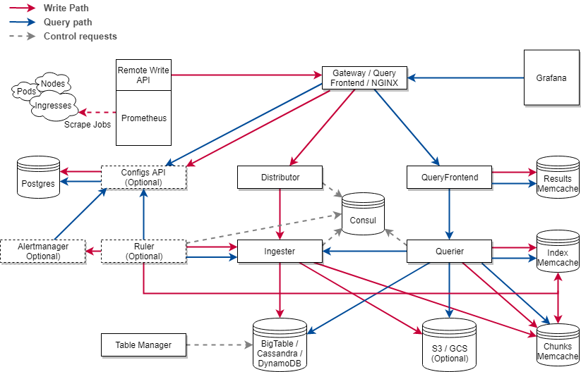

## [Cortex 简介](https://github.com/cortexproject/cortex)

Cortex 是weaveworks公司推出的一款针prometheus数据存储的时间序列存储解决方案。

Cortex 解决的主要问题如下:
 1. 水平扩容
 2. 高可用
 3. 多租户
 3. 长期持久化存储

**A horizontally scalable, highly available, multi-tenant, long term Prometheus**

## Cortex 架构

### Cortex 架构

### 架构解析

数据写入路径: 
   Prometheus-> Gateway -> Distributor -> Ingester -> DSF/BigTable/S3/Gcs/Chunks/Memcache

### 采集组件

Prometheus作为一个采集组件，兼容Prometheus的采集生态。通过反项代理做数据接入层网关。
通过Prometheus 的  remote write API 实现数据摄入，并且在 HTTP 请求头中，增加 bear toke 作为租户ID，实现多租户功能。

### 数据分发组件
写入的数据样本通过distributor组件，实现分发。

### 查询组件
增加了统一数据查询组件 Querier,和查询优化组件Query Frontend，处理用户请求。

### 存储组件

当前支持两种类型的存:
* Chunks (default,stable)
* Blocks (experimental)

#### Chunks Storage 

chunks storage 将每个时间序列存储单独存储到一个叫 chunk 的对象中。
chunk 包含了一个时间段(默认12小时)的序列。
Chunks 可以被时间和标签索引，从而提高快速查询能力。

通过把 Chunk 数据 和索引数据分离，可以找到针对这两者的很多替代的底层存储实现。
- Chunks 的索引，可有如下数据库存储:
  * Amazon DynamoDB
  * Google Bigtable
  * Apache Cassandra
- Chunk 数据本身，可由如下数据库存:
  * Amazon DynamoDB
  * Google Bigtable
  * Apache Cassandra
  * Amazon S3
  * Google Cloud Storage
  * Microsoft Azure Storage

可以看到，为了兼容不通的后段存储库，需要抽象一个统一的接口。cortex 将此
接口，成为 “chunks store”。 由于 "chunks store " 只是一种存储chunk
的一种数据契约，可以有很多种实现，因此，这里并没有把其做成一个服务，而是提
供了一个可以嵌入的lib 库。 此Lib库，可以被 ingester,querier 和 ruler引用。

#### Blocks storage 

     note: chunk vs block
     这里的 block 有多个 chunk 构成

块存储，基于Prometheus的 TSDB: 将每个租户时间序列存储到他们自己的磁盘块文件中，
这些磁盘块默认是2小时一个周期。每个块是由 chunks 和 block index 块索引文件压缩而成。

TSDB 的 chunk 文件包含了多个序列的采样数据。chunk 内的时间序列是被block的索引所索引，这部分索引是对chunk 文件中序列的指标名称和标签做的索引。

这个blocks storage不需要为索引提供专有的后段存储。仅仅需要一个对象存储来存
block file:

* Amazon S3
* Google Cloud Storage
* Microsoft Azure Storage
* Local Filesystem (single node only)
* OpenStack Swift (experimental)

更多的后端[块存储 block-storage ](https://cortexmetrics.io/docs/operations/blocks-storage/)，可以参考文档。

## Cortex 服务组件

Cortex 是一个基于服务的架构，在这个体系架构中，整个系统被分成执行特定任务的各种组件。这些组件能够独立的并行运行。Cortex 也可以单进程模型的方式运行，所有的组件在一个进程中执行。单进程模式对于本地测试和开发特别方便。

在很大程度上，Cortex 也是一个 shared-nothing 架构的系统。系统的每个层都可以运行每个组件的多个实例，并且各个实例之间不需要协调和相互通信。

### 服务组件如下:

* Distributor
* Ingester
* Querier
* Query frontend (optional)
* Ruler (optional)
* Alertmanager (optional)
* Configs API (optional)
* Distributor

### Distributor

接受来自Prometheus RemoteWrite 过来的数据。做验证，有效的数据会分成
batches 发送给 数据摄入组件 ingesters. 数据校验关键点：
1. 指标标签名称是否正确。[指标名称命名规范参考](https://prometheus.io/docs/concepts/data_model/#metric-names-and-labels)
2. 符合配置的指标对应标签的最大个数 
3. 符合配置的 标签名称和Value 最大长度
4. 上报的采样数据的时间戳是否在配置限定的时间区间内 (min/max)

Distributors 是无状态的，可以水平扩缩容.

Distributors 有高可用追踪器(High Availability (HA) Tracker)的特点。当启用时，可以对冗余prometheus的采样数据去重。
HATracker 是基于cluster 和 replica的标签进行去重的。cluster 标签唯一标示了一个特定租户的某个集群的 prometheus 实例，而 replica 唯一标识普罗米修斯群集内的副本。
去重逻辑很简单，如果收到的replica 不是集群中当前的主 replica，则认为传入的样本是重复的，从而被丢弃。
HATracker 如何知道那个replica 是主呢？
* Consul
* Etcd

这两种方案的配置，参考 [HA 键值对配置](https://cortexmetrics.io/docs/production/ha-pair-handling/)

#### Distributor 如何将数据发送给 ingester ?

##### 通过 Hashing

Distributor 支持两种hash策略，可配置
1. 默认通过指标名称和 租户ID做hash
2. 通过指标名称，lables 和 租户ID 做hash

##### Hash 环

所有的 ingester 会向中心注册（kv sttore su as consul or etcd)。
注册时会带上一个 32位的随机数做token , 这个token 决定了一个hash key 的区间，
在此区间的 序列将发送到这个 token 所映射的 ingester。

####  一致性(Quorum consistency)

为了取保查询的一致性，Cortex 采用了 [Dynamo-style](https://www.allthingsdistributed.com/files/amazon-dynamo-sosp2007.pdf), 
即, 写入必须等到 超过半数+1 个 ingester 返回成功才算成功

### 数据摄入组件 Ingester 

数据摄入组件，实现输入的序列写入到长期存储的后端服务，并提供热数据(缓存在内存中数据)的查询。

Ingester 收到数据后，并不会立刻到后端存储，而是会在内存中缓存。这样做的好处是
1. 对于实时热数据的预计算提供更好的查询性能
2. 对与告警策略计算的更友好
也因此，Ingesters 是半状态化的服务。

但这回带来潜在的数据丢失风险，若 ingester 异常挂掉，那么收到数据，在内存中，尚未写入后端存储的数据就会丢失，解决这个问题的办法有两个
1. 副本  Replication
2. WAL  Write-ahead log

### Querier

Querier通过PromQL 提供查询服务。Querier 从 ingesters 和 long-term
存储中查询数据，并通过时间戳来做去重

Querier 是无状态的，可以水平做扩缩容。

### Query frontend 

查询前端是一个 可选的服务，用来加速查询路径。

query frontend 在内部执行一些查询调整，并将其保存在内部队列中。query组件
充当真正的worker , 从队列中提出作业，执行并返回给 query frontend, 以便其
做聚合
查询前端是无状态的，通常会部署两个副本 。

查询前端的队列机制的主要目的：
1. 确保大的查询 - 比如可能会造成OOM错误的，返回错误。
2. 通过先进先出（FIFO）队列，将多个大型请求分发到所有的查询器上，访问他们被
送往单个查询器上。
3. 防止由于其它租户的非

其它查询优化的策略：

* 分割（Spliting）
  将一个多天的查询请求拆分成多个单天的查询请求，并行的执行这些请求，在将结果和合并。查询优化的例子如下图

* 缓存(Caching)
  查询前端支持缓存查询结果，并在后续查询中重用这些结果.
  如果缓存的结果不全，查询前端会计算子查询并会并发执行这些子查询
  当前cortex 的缓存后端 支持 memcached, redis , 内存缓存，这些都可以用来缓存查询结果。

查询组件架构如下：

### Ruler

Ruler 是一个可选服务，执行PromQL 的查询来 实现预计算和告警。
Ruler 也是一个半状态的组件，可以被水平扩容。

### Alertmanager

 告警服务，在prometheus alertmanager 之上构建的，增加了多租户的支持。
 需要一个数据库来存储租户的配置信息。

 ### Configs API 

 可选组件，管理 Ruler 和 Alertmanagers 的配置信息。
 提供API来对 规则和告警的配置进行增删改查，并将这些信息存储到后端数据库。