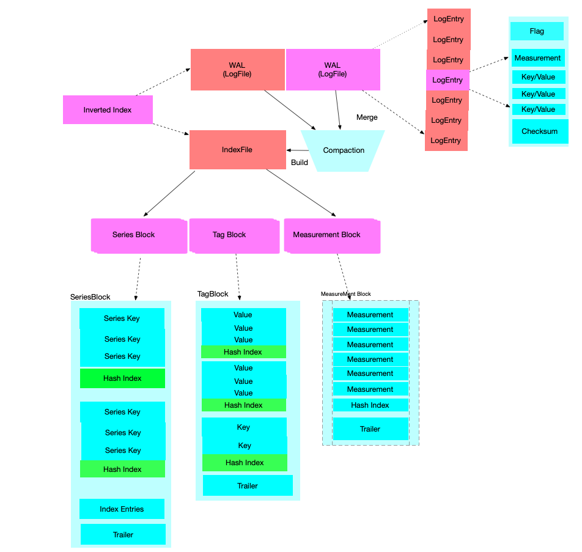

# 时间序列索引(Time Series Index)


## 术语表

| 术语  |  描述 |简称
|:------|:-------|:-------|
| Time Series Index| 时间序列索引|TSI |
| Time-Structured Merge Tree| 时间结构合并树|TSM|
| Log-Structured Merge Tree| 日志结构合并树|LSM|
| Time Series| 时间序列 | TS |
|Time Series Key|由measurement、tag key-value pair<br>和field Name 构成的唯一主键 | TSK |
|Inverted Index| 倒排索引 | - |


## TSI 的背景

Influxdb 数据摄入后，不仅存储数据信息，也会基于 measurement,tag 构建索引。从而能提供
高效的多维度查询能力。早期的时候，索引全部构建在内存中，这导致了influxdb 摄入数据的能力上限
受到机器内存的制约。
因此，引入了基于磁盘存储的索引。TSI 使用操作系统的页缓存来实现冷热数据的分离。热数据放在缓存，
而冷数据放在磁盘。

### TSI 概览

[Influxdb 实际看上去，像两个数据库合并为一,一个时间序列数据存储(TSM)
和一个对指标，标签，和元数据字段(field)的倒排索引 (TSI ).](https://docs.influxdata.com/influxdb/v1.8/concepts/time-series-index/#issues-solved-by-tsi-and-remaining-to-be-solved)

```
InfluxDB actually looks like two databases in one, a time series 
data store and an inverted index for the measurement, tag, and 
field metadata.
```


### TSI 面临的挑战

在InfluxDB 1.3之前，TSI 只支持Memory-based的方式，即所有的TS的索引都是放在内存内。
这意味着，对于每个序列 SeriesKey (由 measurement、tag key-value pair 和 failed Name 构
成的唯一主键)，都会在内存中维护一个 SeriesKey 到序列的映射。 这种方式的好处就是查询效率高，但也
存在不少问题，主要的问题如下：

* 支持的Series基数有限。 

    主要受制于内存的限制。若TimeSeries个数超过上限，则整个数据库会处于不可服务的状态。这类问题
    一般由用户错误的设计TagKey引发，例如某个TagValue是一个随机的ID。一旦遇到这个问题的话，也很
    难恢复，往往只能通过手动删数据

* 进程重启，恢复数据的时间会比较长。

   因为需要从所有的TSM文件中加载全量的TimeSeries信息来在内存中构建索引。

* [时间序列数据的序列分流问题](https://fabxc.org/tsdb/)。 这应该是最严重的问题
    
   所谓的时间序列分流，指的是某些序列中的Tag value 值，会存在一段时间就消失了，常见的场景比如
   容器环境下某个POD的ID，当POD飘逸后，之前的POD ID对应的序列就消失了。但这些序列还会在内存中
   存在，这对于近期的数据查询来说是无效的，但是会严重的影响查询性能，而且随着时间的积累，内存的
   这种序列会越来越多，最终导致服务不可用。

## TSI 的解决方案

而在InfluxDB 1.3版本后，提供了另外一种方式的索引可供选择，新的索引方式会把索引存储在磁盘上，效率上相比内存索引差一点，但是解决了上述的问题。

## TSI 存储布局

### TSI存储结构

TSI (Time Series Index) 也是一个 基于LSM 的数据库，主要包括如下四块：

索引： 包含一个数据分片的索引的数据集

分区： 包含一个数据分片的 数据分区。- Influxdb的数据，首先会从时间范围做Shard，每个
时间范围内的Shard，会在基于SeriesKey做 Shard Partition。

日志文件： 包含 内存索引中最新写入的序列，类似WAL。

索引文件： 有日志文件（WLA）构建而成的包含一个不可变的，内存映射索引的索引，或是有两个
连续的索引文件合并而成的一个大索引文件。

```
Index: Contains the entire index dataset for a single shard.

Partition: Contains a sharded partition of the data for a shard.

LogFile: Contains newly written series as an in-memory index and is persisted as a WAL.

IndexFile: Contains an immutable, memory-mapped index built from a LogFile or merged
 from two contiguous index files.

```

### TSI构建

#### 写入逻辑

以序列写入流程，分析TSI的构建过程。

1. 新的序列写入到达后，先加入序列文件，或者查找该序列是否存在，如果不存在，在生成一个自增的ID。
   这个自增的ID 和 Measurement，Tag Key-Vaule Pair,Filed 是一一映射的

2. 新写入的序列被发送给索引。索引维护了一个 由序列ID构成的 有序的 高效压缩位图[RoaringBitmap](https://github.com/RoaringBitmap/RoaringBitmap) , 并会忽略掉已经存在的序列ID。

3. 对序列做Hash，然后发给合适的分区

4. 对应的分区将该序列写入 日志文件

5. 该日志文件，将该序列写入到 磁盘上的WAL，并将其加入到内存索引集合中。

#### 合并逻辑

   一旦 LogFile 超过1M大小，就会产生一个新的日志文件，之前的日志文件开始合并到索引文件中。
第一个索引文件是 Level1 (L1), 而之前的日志文件 可以认为是 Level 0 (L0).
   索引文件也可以有两个小的索引文件合并而成。例如:两个连续的 L1 级的索引文件 可以合并为一个
L2 级的索引文件。

这部分应该是借鉴了LevelDB、Cassandra的Compaction方法。类似的实现，如HBase 的[Stripe
Compaction](https://issues.apache.org/jira/browse/HBASE-7667),更多Level Compaction
的相关信息，请移步[6.4 Level Compaction](../../chapter6/LevelCompaction.md)


### TSI 提供的能力

TSI的 是为了解决倒排索引问题，他需要回答的核心问题是：

* 当前有哪些指标（measurement）?

* 有哪些标签？

* 给定的标签有哪些Value值？

* 一个指标包含那些序列ID？ 

* 给定一个标签，或一些标签，甚至一个模糊匹配的标签，能匹配到那些序列？

* 给定一个标签值能匹配到那些序列？

这几个问题，索引通过6种类型的迭代器解决。

```
MeasurementIterator(): Returns a sorted list of measurement names.

TagKeyIterator(): Returns a sorted list of tag keys in a measurement.

TagValueIterator(): Returns a sorted list of tag values for a tag key.

MeasurementSeriesIDIterator(): Returns a sorted list of all series IDs for a measurement.

TagKeySeriesIDIterator(): Returns a sorted list of all series IDs for a tag key.

TagValueSeriesIDIterator(): Returns a sorted list of all series IDs for a tag value.

```
以上的迭代器，是可以相互组合的。而且每种类型(measurement,
tag key, tag value,series id等)的迭代器，实现了交集，并集，差集的能力。


```
Merge: Deduplicates items from two iterators.

Intersect: Returns only items that exist in two iterators.

Difference: Only returns items from first iterator that don’t exist in the second 
iterator.

```


### TSI 的文件结构


#### 概览

首先，提供一张概览视图，全局了解tsi 的文件结构。TSI 主要由四大文件构成：LogFile文件，Index文件，Mainfest文件，FileSet。下图展示了核心两大文件的结构图：



新增的序列，首先写入 WAL(LogFile)。LogFile 的文件结构很简单，有一个个LogEntry构成。
LogEntry 有一个Flag 标记当前的类型（增加/删除 序列或标签 ）, measurement，一系列的 k/v,
以及check sum构成。

随着LogFile文件的不断变大(超过5M的时候),会被Compaction合并,并构建成索引文件 Index File.

Index File 有三中类型的数据块构成。序列块(SeriesBlock)，标签块(Tag Block)，和指标块
(Measurement Block)。


#### 各个文件结构详解

 #### LogFile

 LogFile 是由 按序写入磁盘的一系列 LogEntry构成。
 LogFile 大小超过5MB 就会被合并为 Index 文件。
 日志文件的 LogEntry 可能是如下接种类型：
 * 增加的序列
 * 删除的序列
 * 删除的指标（measurement）
 * 删除的标签键（TagKey）
 * 删除的标签值 (TagValue)

日志文件也维护了一个 与现存的序列ID 和 tombstones 相关的 bisets.
在服务启动的时候，可基于这些 bitsets 和 其他的日志文件 ，索引文件重新生成
全量的 index bitsets.


 #### 索引文件

 Index File 有三个主要的类型的块文件构成：
 序列块，一个和多个标签块，一个指标块。每个数据块的末尾，都包含一个 trailer.
 trailer 描述了 这些块的一些元信息，比如偏移量。

 #### Manifest file
 
 索引是有 WAL 和 Index文件 构成的一个有序集合。这些文件 在做合并和重写操作的时，
 需要保持有序。保持有序是为了对 序列，指标，或标签 的标记删除有利。
 
 当该集合的活动文件变动时，mainfest 文就会被重写，从而保持对该集合的追踪。在服务
 启动时，manifest 能指定文件的顺序，并且不在manifest中的文件，会被从索引目录中删除；


 #### 索引文件的合并（compacting index file）

  TSI的合并有两个主要步骤：

首先： 一旦日志文件大小超过阈值，他们就会被合并为一个索引文件。 日志文件的阈值会设置
的相对较小，主要处于如下两个原因的考虑：
  
    TSI 为了避免在内存堆中维护日志文件的索引

    小的日志文件也很容易转化为Index文件。

其次： 一旦一个连续的索引文件集超过了负载因子（通常为10倍），
这些索引文件会被合并为一个大的索引文件，老的索引文件会被丢弃。
由于，所有的块都是有序的，新的索引文件可以流式传输，减小内存使用


 #### FileSet 解决并发问题
 
 索引文件，虽然是不可修改的，但在做合并的时候，我们需要知道那些文件在被使用。
 为了解决这个问题，引入了引用计数。

 一个FileSet 是由一系列有序的索引文件集构成。当文件集被索引获取时，
 计数器增加，当用户使用完 fileSet时，引用计数器减少。计数器不为0的文件
 是不能被删除的。除了引用计数器，索引文件没有其它的锁机制。


## 扩展阅读

[tsi1 design](https://github.com/influxdata/influxdb/blob/master/tsdb/tsi1/DESIGN.md)

[tsi doc](https://github.com/influxdata/influxdb/blob/master/tsdb/tsi1/doc.go)

[RoaringBitmap](https://github.com/RoaringBitmap/RoaringBitmap)

[探索HyperLogLog算法](https://www.jianshu.com/p/55defda6dcd2)

[tsi details](https://docs.influxdata.com/influxdb/v1.7/concepts/tsi-details/)

[Time Series Index (TSI) details](https://docs.influxdata.com/influxdb/v1.8/concepts/tsi-details/)

[InfluxDB详解之TSM存储引擎解析](https://yq.aliyun.com/articles/158312?spm=5176.100239.blogrightarea106382.21.PmSguT)
