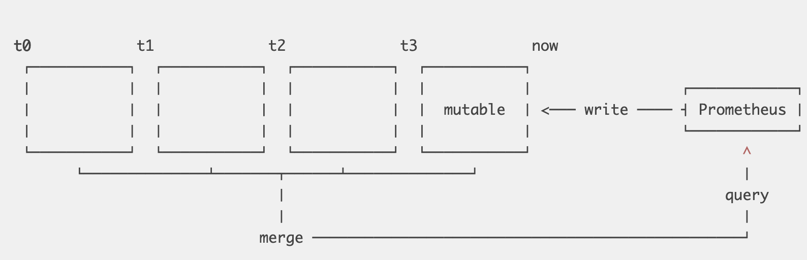
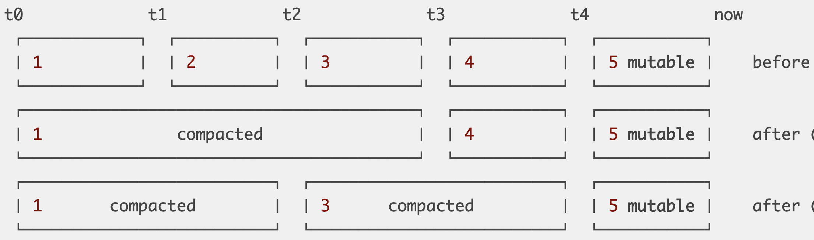

# Prometheus Tsdb 分析


## 数据模型

### 时间序列数据

        identifier -> (t0, v0), (t1, v1), (t2, v2), (t3, v3), ....

每个数据点都是一个由时间戳和值组成的元组。

**Identifier**: metric name + set {(k,v)} <br>
其中，metric name 也可以标示为: __name__ = metric_name

一个序列的数据点标示符（identifier）: 是由指标名称在加上一组唯一的多维度的标签集合构成。
典型的标示符结构如下：

        requests_total{path="/status", method="GET", instance=”10.0.0.1:80”}
        requests_total{path="/status", method="POST", instance=”10.0.0.3:80”}
        requests_total{path="/", method="GET", instance=”10.0.0.2:80”}

指标名称也可以作为一组特殊的 ( k,v)，上述的标示符存储数据模型标示如下：

        {__name__="requests_total", path="/status", method="GET", instance=”10.0.0.1:80”}
        {__name__="requests_total", path="/status", method="POST", instance=”10.0.0.3:80”}
        {__name__="requests_total", path="/", method="GET", instance=”10.0.0.2:80”}

### 数据模型立体分析 

数据序列的数据模型，可基于一个二位坐标展开立体分析。

```
series
  ^   
  │   . . . . . . . . . . . . . . . . .   . . . . .   {__name__="request_total", method="GET"}
  │     . . . . . . . . . . . . . . . . . . . . . .   {__name__="request_total", method="POST"}
  │         . . . . . . .
  │       . . .     . . . . . . . . . . . . . . . .                  ... 
  │     . . . . . . . . . . . . . . . . .   . . . .   
  │     . . . . . . . . . .   . . . . . . . . . . .   {__name__="errors_total", method="POST"}
  │           . . .   . . . . . . . . .   . . . . .   {__name__="errors_total", method="GET"}
  │         . . . . . . . . .       . . . . .
  │       . . .     . . . . . . . . . . . . . . . .                  ... 
  │     . . . . . . . . . . . . . . . .   . . . . 
  v
    <-------------------- time --------------------->

```


**水平方向**: 时间以及该时间对应的垂直方向上的维度标示符构成的标示符空间

**垂直方向**: 多个标签构成的维度空间

由于prometheus的数据源，是周期性的采集一组时序数据的当前值。每个批量采集的实体对象称之为一个target，（比如，采集某个机器上的所有的基础监控指标）。因此，数据写入
模式是，
1. 垂直方向多维度并发写。
比如一次采集一个机器的磁盘，内存，网络，等多个维度的数据，这些数据对应的是同一时刻点上某个机器的指标值。从维度方向看，是并发的。

2. 多个target独立
多个target，即多个机器数据采集之间是相互独立的。


### 读写特性分析

#### 写特性

每秒采集数成千上万的监控对象，这些样本数据写入模式是完全垂直高度并发。分散的写入单个数据点到磁盘非常缓慢，需要实现按顺序写入更大的数据块。即便写入采用SSD磁盘，也只能每次写入4KiB 或更大的页，不能修改单个字节。写一个16字节的样本同写一个完整的4KiB 的页没有区别。 而且不仅存在[写入放大](https://en.wikipedia.org/wiki/Write_amplification)，很快会[损坏硬件](http://codecapsule.com/2014/02/12/coding-for-ssds-part-1-introduction-and-table-of-contents/)。

结论：
[**顺序和批量写入是spinning disks和SSD的理想写入模式。 这是一个应该遵循的简单规则。**](https://fabxc.org/tsdb/)

#### 读特性

如上文的分析，查询通用的场景： 
1. 查询单个序列某个特定时间的数据
2. 在 N（N=～10000）个序列里查询一个单个的数据点
3. 在单个序列里查询几周的数据点
4. 甚至在10000个序列里查询几周的数据点

因此在我们的二维平面上，查询既不是完全垂直的，也不是水平的，而是二者的矩形组合。
Recording Ruel （即针对特定复杂聚合数据的查询做预计算），可以减轻已知的一些查询方面的问题，但是仍然不是临时查询（ad-hoc queries）的一个通用解决方案，这些查询也必须能很好的进行下去. 在理想情况下，相同序列的样本数据将会被顺序存储，这样一来我们便可以用尽可能少的读来扫描得到它们。 在上层，我们只需要知道这个序列可以访问的所有数据点的开始位置。


结论：
[**在将收集的数据写入磁盘的理想模式和为服务的查询操作提供更显著有效的存储格式之间显然存在着强烈的冲突。这是我们的时间序列数据库要解决的根本问题**](https://fabxc.org/tsdb/)


## 解决方案


### V2 及以前的解决方案


V2 版本的核心点是基于 Per Series Per File. 即每个时间序列创建一个文件，此文件
会按顺序存放这个序列的所有采样数据。 由于时间序列数据的特性**顺序和批量写** 是理想模式，因此，在写入引入了chunk 的概念。在内存中，构建了批量大小为1KiB的
chunk,当这个chunk 块被填满后，将他们追加到对应的序列文件中。
   此方案，解决了大部分问题，并支持 Gorilla的高效压缩算法。

数据写入示意图如下：
```
   ┌──────────┬─────────┬┬─────────┬─────────┐           series A
   └──────────┴─────────┴┴─────────┴─────────┘
          ┌──────────┬─────────┬┬─────────┬─────────┐    series B
          └──────────┴─────────┴┴─────────┴─────────┘ 
                              . . .
 ┌──────────┬─────────┬─────────┬─────────┬┬─────────┐   series XYZ
 └──────────┴─────────┴─────────┴─────────┴┴─────────┘ 
   chunk 1    chunk 2   chunk 3     ...
```

V2 版本的数据结构存在的问题：

1. "序列分流"（series churn）会导致维护的文件数据多于实际采集数据的序列数量。随着时间的推移，最终导致 inode 耗尽的问题
2. 即便做了分块，每秒也会产生数以千计的数据块并且准备好被持久化。这仍然需要每秒完成几千次单独的磁盘写操作。尽管，可以通过批量写多个chunks 来缓解部分压力，但这发而会增加等待持久化数据的总内存占用量
3. 保持打开所有文件来读取和写入是不可行的。特别是因为在24小时后超过99%的数据便不再会被查询。如果它还是被查询到的话，我们就不得不打开数千个文件，查找和读取相关的数据点到内存，然后再重新关闭它们。而这样做会导致很高的查询延迟。
4. 过期数据的删除，带来写放大。旧数据必须得被清理掉，而且数据需要从数百万的文件前被抹除。这意味着删除实际上是写密集型操作。此外，循环地在这数百万的文件里穿梭然后分析它们，会让这个过程常常耗费数个小时。在完成时有可能还需要重新开始。删除旧文件将会给你的SSD带来进一步的写入放大！
5. 应用服务崩溃，引发数据丢失，基于checkpoint 恢复，也会带来漫长的启动周期。
当前堆积的数据块只能放在内存里。如果应用崩溃的话，数据将会丢失。为了避免这种情况，它会定期地保存内存状态的检查点（Checkpoint）到磁盘，这可能比我们愿意接受的数据丢失窗口要长得多。从检查点恢复估计也会花上几分钟，造成痛苦而漫长的重启周期。

每个时间序列对应一个单个文件的方式使得单个查询很容易就击垮Prometheus的进程。而当所要查询的数据没有缓存到内存时，被查询序列的文件会被打开，然后包含相关数据点的数据块会被读取到内存里。倘若数据量超过了可用内存，Prometheus会因为OOM被杀死而退出。


### V3 版本的解决方案

#### V3 宏观设计

```
$ tree ./data
./data
├── b-000001
│   ├── chunks
│   │   ├── 000001
│   │   ├── 000002
│   │   └── 000003
│   ├── index
│   └── meta.json
├── b-000004
│   ├── chunks
│   │   └── 000001
│   ├── index
│   └── meta.json
├── b-000005
│   ├── chunks
│   │   └── 000001
│   ├── index
│   └── meta.json
└── b-000006
    ├── meta.json
    └── wal
        ├── 000001
        ├── 000002
        └── 000003
```
先看下V3 宏观的数据结构。有一些编号的Block，都有一个 b- 前缀，每个Block ,都维护一个包含索引的文件以及一个包含 chunks 目录，chunks 目录包含了多个 chunk 文件。chunk 文件类似V2 版本的 chunk，这样可以用非常低的成本来读取一个时间窗口里的序列数据，并且允许我们采用相同的有效压缩算法，很显然，这里不再是每个序列对应一个单个文件，取而代之的是，几个文件包含许多 序列的 chunks。"index"文件，包含了大量的黑魔法，允许我们找出标签，它们可能的值，整个时间序列，以及存放数据的 chunk 。

关键的两个问题：

1. 为何有几个目录包含 index 和 chunk 的文件布局呢？
2. 为何最后一个包含一个 wal 目录？ 

#### 很多小的数据库（Many Little Databases）

将序列数据的水平维度，即时间空间分割成非重叠的block。每个block当成一个完全独立的数据库，包含其时间窗口的所有时间序列数据。因此，它有自己的索引和一组chunk 文件。



每个block 的数据是不可变的。当然，对于最新采集的数据，我们必须能够将对应的序列和采样数据写入到最近的block里。对于最新的block , 所有的新数据被写入在内存数据库
中，它像持久化的block 一样提供了查询的特性。内存数据结构能更有效的更新。为了防止数据丢失，所有传入的数据也会写入一个临时的WAL，即“wal”目录中的一组文件，在重新启动时可以从中重新填充内存中的数据库。

所有这些文件都带有它们自己的序列化格式，这与我们所期望的一样：许多标志、偏移量、变量和CRC32校验和。


这种布局允许我们对与查询的时间范围相关的所有 block 发出查询.每个 block 的部分结果合并在一起，形成整体结果。

    This layout allows us to fan out queries to all blocks relevant to the queried time 
    range. The partial results from each block are merged back together to form the 
    overall result.

这种水平分区添加了一些强大的功能：

1.  当查询一个时间范围时，我们可以很容易地排除掉在次时间区间之外的block.
简单的解决了序列分流(seriers churn) 的问题--因为减少了数据集的起始时间。

2.  当完成一个block ,就可以 通过顺序的写入几个大文件来持久化 内存中的数据库，
从而避免了写放大，并且对 SSDs 盘 和 HDDs 盘一样友好。

3. 保留了 V2 版本中好的一个特性，即最近查询较多的 chunks, 作为热数据而存内存中。
4. 更棒的是，不用在绑定固定的1KiB 的 chunk 大小来以更好做磁盘的数据对齐。可以选择对对个数据点和选择的压缩格式最匹配的任何大小。

5. 删除过期数据变得更廉价和及时。在之前，删除过期数据，必须要分析多达数亿个文件，
可能需要几小时才能聚合，而现在只需要删除当一个目录就可以。


## V3 版本中的关键技术点

### mmap

从上百万个小文件到几个大文件的转化，让我们用很小的开销就能保持所有的文件打开。这使我们解锁了 [mmap（2)](../../chapter6/mmap.md)的使用。mmap 是一个系统调用，可以通过虚拟内存区建立到磁盘文件的映射，可以简单看作一个交换空间。
这意味着我们可以将数据库中的所有内容视为内存中的内容，而不占用任何物理RAM。只有当我们访问数据库文件中的某些数据时，操作系统才会从磁盘做数据懒加载。

在机器的内存资源充足的时，prometheus 可以积极的将数据缓存到内存中，在内存紧张，
其它应用需要时内存时候，prometheus缓存的数据可以被驱逐出去，将内存返回给其它应用。直接将持久化数据装入RAM 比这种查询更多持久化的数据更容易造成我们进程的OOM。
内存的缓存大小变得完全自适应，只有真正查询时才会加载数据。

### 压缩(Compaction)

存储服务，周期的切割出一个新的block, 并将前一个block （当前已经完成的）写入磁盘。只有当block 成功持久化后，用于还原内存block 的WAL 才会被删除。

为了避免在内存中积累过多的数据，我们希望每个block都保持合理的大小.(通常默认2小时)
当查询多个block时候，我们需要将结果合并到一个整体结果中。这个合并过程必然要付出代价。一周范围的查询，合并的block不应超过80+个部分结果。

为了兼顾二者,（ 1. 内存block太大就会造成索引占用过多内存，2. block 块太小，会导致查询聚合的block 过多）我们引入了压缩，Compaction.

Compaction 描述了获取一个或多个数据block,并将其写入一个可能更大的数据Block的过程。在此期间，可以修改现有数据，比如删除，或重构样本的chunk 来提升查询性能。




如上图，可以有两种策略的压缩，chunk [1,2,3,4] 有序，
一种将 [1,2],[3,4] 做合并，或者 [1,2,3],[4]  合并

合并后，显著的降低了查询时的聚合成本，因为需要合并的部分结果更少。


### 保留策略(Retention)


```
 ┌────────────┐  ┌────┼─────┐  ┌───────────┐  ┌───────────┐
 │ 1          │  │ 2  |     │  │ 3         │  │ 4         │   . . .
 └────────────┘  └────┼─────┘  └───────────┘  └───────────┘
                      |
                      |
             retention boundary

```

V2 版本中，删除过期数据会对CPU，内存，磁盘都带来压力，在此版本中，删除变得很简单，只需要删除过期的目录即可。如上图，block 1 可以删除，block 2 需要等到完全覆盖过期时间窗口后才可以删除。

由于我们持续做Compaction, 当数据越旧，block 可能变得越大。因此，必须设置一个上限，防止block 不会扩展到整个数据库，而丧失我们设计初衷带来的好处。

这个值究竟设置多大何合适呢？当将最大块大小设置为总保留时间窗口的10%。
如上图中，block 2，总的block 大小设置为保留窗口的 10% ，在保留窗口外部的block大小也被限制在了10% 以内。

简而言之，通过block 的方式，将非常昂贵的保留删除操作变得非常廉价。


```
note: 在内存中批量处理数据，通过WAL 追踪，周期的刷入磁盘，定期合并的模式
非常普遍。
无论数据的领域细节如何，我们看到的好处几乎普遍适用。遵循这种方法的开源数据库
如：LevelDB,Cassandra,Influxdb,Hbase等。
```

### 索引(Index)

#### 动机

研究存储改进的最初动机来自 "序列流失" (Seriers Chrun) 带来的问题。
基于 block 的布局减少了服务查询时必须考虑的序列总数--因为大部分的查询总是对近期数据的查询，然而跨越整个时间范围的查询仍然很慢。
从时间序列查询的特性分析可知，大部分的查询场景需要： 一个更有效的倒排索引。

#### 查询复杂度分析

倒排索引，提供了基于数据项的子集快速查找数据项的能力。举例来说，如果想查询带有标签
app = "nginx"的序列，不需要遍历所有的序列，挨个检查是否他们是否包含这个标签，
而只是维护一个 以 app = "nginx" 这个标签的一个集合，判断给定的序列是否在这个集合内。

为此，每个序列都被分配了一个唯一的ID，通过这个ID可以在恒定的时间内检索它，即
O(1)。在这种情况下，ID 是我们的 正排索引。


> Example: If the series with IDs 10, 29, and 9 contain the label app="nginx", the inverted index for the label “nginx” is the simple list [10, 29, 9], which can be used to quickly retrieve all series containing the label. Even if there were 20 billion further series, it would not affect the speed of this lookup.


如果n是序列的总数，m是给定查询的结果大小，那么使用索引的查询的复杂性现在是O(m)。查询按其检索的数据量（m）而不是搜索的数据体（n), m 通常比 n 要小得多.

##### 组合标签问题

如果我们的序列总数为N，需要查询的K个标签的组合条件，最差情况，时间复杂度O(K^N)
如何降低我们的查询时间复杂度？

解决方案:

    倒排索引如何提升查询效率 ？ 
    如果我们的序列是 ID 是全局有序的会带来那些优势？

举例分析:
假设：我们需要查找服务名为 foo 的 http 请求数的指标，

     __name__ =  "requests_total "  AND app = "foo",
这两个标签对应的倒排索引如下图：

```
__name__="requests_total"   ->   [ 9999, 1000, 1001, 2000000, 2000001, 2000002, 2000003 ]
     app="foo"              ->   [ 1, 3, 10, 11, 12, 100, 311, 320, 1000, 1001, 10002 ]

             intersection   =>   [ 1000, 1001 ]
```
他们的交集会非常小。上述问题转变为在两个集合中，找到交集。我们可以通过在每个列表的开头设置一个光标，并总是在较小的数字处前进一个来找到它。当两个数字相等时，我们将数字加到结果中，并向前推进两个游标。
这种方式，总的时间成本为 O（2n）= O (n),因为我们只在其中一个列表中前进。
以上方案，推广到K个标签组合场景，最坏情况下的时间复杂度为 O(K*N),
而之前是 O（K^N)

##### 结论

经过倒排索引，将查询的时间复杂度从 O（K^N）-> O (K*N)；
而通过对 ID 的有序排列，可以简化K个集合计算交集的复杂度。


**为什么不对标签进行压缩？**

以上的规程其实是规范搜索引擎的一个简化版本，几乎所有的全文搜索引擎都在用这种方式。
每个序列描述符都被视为一个简短的“文档”，每个标签（名称+固定值）都被视为其中的一个“单词”。我们可以忽略搜索引擎索引中通常会遇到的许多附加数据，例如单词位置和频率数据。

对于改善实际运行时的方法，似乎有着无尽的研究，通常会对输入数据做出一些假设。有很多技术可以压缩倒排索引，这些倒排索引都有各自的优点和缺点。由于我们的“文档”很小，而且“单词”在所有系列中都有很大的重复性，压缩变得几乎无关紧要。例如，一个拥有约440万个系列、约12个标签的真实数据集的唯一标签不到5000个。对于我们最初的存储版本，我们坚持基本的方法，不进行压缩，只添**加了一些简单的调整，以跳过大范围的非相交id。**

虽然保持id的排序听起来很简单，但它并不总是保持不变的。例如，V2存储将序列的Hash作为id分配给新序列，因此无法有效地构建排序的反向索引。

另一项艰巨的任务是**在数据被删除或更新时修改磁盘上的索引**。通常，最简单的方法是简单地重新计算和重写它们，但是这样做的同时需要保持数据库的可查询性和一致性。
V3存储正是通过为每个块提供一个单独的不可变索引来实现这一点的，该索引只在压缩时通过重写进行修改。只需要更新完全保存在内存中的可变块的索引。


## 扩展阅读

[Writing a Time Series Database from Scratch](https://fabxc.org/tsdb/)