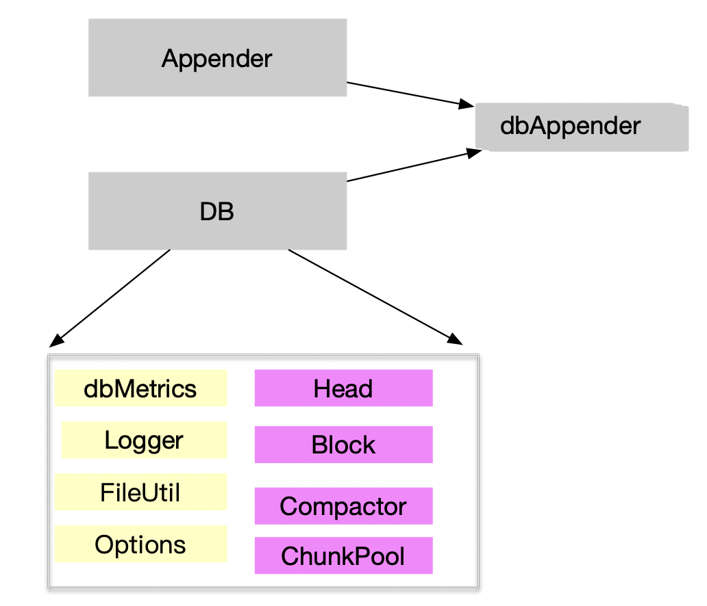

# tsdb 存储引擎实现分析

上一文，对prometheus tsdb 的设计理念及要解决的核心问题有一个宏观的了解。本节将深入到代码层次，分析tsdb 的存储引擎实现

## 目录

- 存储引擎的实现结构概览
- 内存功能及数据结构分析
- DB 初始化过程
- 数据写入路径分析
- 总结

## 存储引擎的实现结构概览

### 核心功能

核心功能: 能处理落到一个Hash分区的时序数据的读写请求。 

由于写入操作，针对的是时间序列数据，之前的数据模型抽象为:

    set { (k,v)}, v , t 即: labels 集合 , 当前值,时间戳.

由于数据采样点到来的时刻存在一定的随机性，我们需要能够支持Append 操作，等到Append一定量时，批量提交；若写入失败可以回滚。每次批量请求到来，会创建一个新的Appender。
Appender  是对用户写入操作的抽象，DB是数据引擎的抽象，二者结合，实现了tsdb, 简化图如下:

其中，db 的核心模块包括：
紫色部分，为DB的核心概念模型
1. Head 时间序列的内存数据结构
2. Block 水平方向的时间分片
3. Compactor 负责block 的 Compaction, 过期数据的删除等
4. chunkpool : chunk 池

浅黄色部分，提供了基础的工具类模块:

5. FileUtil: 文件工具类，提供多个block 文件的锁
6. log,dbMetrics,Options 默认配置


###  DB 的内存数据结构简化表达如下：

```
// DB handles reads and writes of time series falling into
// a hashed partition of a seriedb.
type DB struct {
    ...
	dir   str  // DB数据的目录路径
    lockf fileutil.Releaser // 对一个文件锁提供 Release 方法
	logger    log.Logger   // 基础的日志类
	metrics   *dbMetrics   // db 的监控指标，提供系统的可观测性
	opts      *Options    // 一些默认的参数，比如WAL Segment大小，每个Block的时间窗口，默认过期时间15天等
	chunkPool chunkenc.Pool  //chunk 池
	compactor Compactor  // compaction 的执行器
	blocks []*Block   // 内存block 
	head *Head     // 内存倒排索引数据结构的承载主体，核心的内存数据结构
    ...
}
```


## 内存功能及数据结构分析

### 内存核心功能分析

数据写入内存后，必须要有一个内存数据结构，实现数据序列热数据缓存。能对一个
时间窗口（默认2小时）的时序数据的读写操作。这个数据结构需要完成如下功能：

- 能维护一个全局有序的正排索引

```
    1.1 所有的序列，可以通过ID或Hash O (1) 时间获取
      //All series addressable by their ID or hash.
      series         *stripeSeries
    1.2 一个标签对应那些Value
       values  map[string]stringset // Label names to possible values.
```

- 能维护一个倒排索引


        每个标签(k,v)对，对应的序列ID列表
        postings *index.MemPostings // Postings lists for terms.

-  有一个WAL组件

        wal          *wal.WAL

-  维护 内存chunk 到磁盘 chunk 映射

        // chunkDiskMapper is used to write and read Head chunks to/from disk.
	    chunkDiskMapper *chunks.ChunkDiskMapper

### 内存数据结构

以上的功能是通过 Head 来承载的。Head 的数据结构简化标示如下：

```
// Head handles reads and writes of time series data within a time window.
type Head struct {
	...
	chunkRange       int64    
	numSeries        uint64 
	minTime, maxTime int64 // Current min and max of the samples included in the head.
	minValidTime     int64 // 加入Head的数据的最小有效时间，必须比最近持久化Block的的最大值大。Mint allowed to be added to the head. It shouldn't be lower than the maxt of the last persisted block.
	lastSeriesID     uint64   // 最后一个序列的ID，
    ...
	wal          *wal.WAL    
	logger       log.Logger
	...
	// All series addressable by their ID or hash.
	series         *stripeSeries   // 所有序列构成的一个散列集合，可以通过序列ID或Hash获取对应的区域，从而减小锁竞争
    ...
	symbols map[string]struct{}  // 符号表
	values  map[string]stringset // 标签名对应的倒排，一个标签有那些Value
    ...
	postings *index.MemPostings // 倒排索引
	tombstones *tombstones.MemTombstones  // 内存 tombstones
    ...
	// chunkDiskMapper is used to write and read Head chunks to/from disk.
	chunkDiskMapper *chunks.ChunkDiskMapper
	// chunkDirRoot is the parent directory of the chunks directory.
	chunkDirRoot string
	...
}

```
值得一提的是，倒排索引 MemPostings ,标签名称Key，为第一层Map的Key，Value为第二层Map的Key，第二层Map的Value则为包含次标签的序列 ID的一个数组。

```
// MemPostings holds postings list for series ID per label pair.
// They may be written to out of order.
type MemPostings struct {
	mtx     sync.RWMutex
	m       map[string]map[string][]uint64  // 标签名称Key，为第一层Map的Key，Value为第二层Map的Key，第二层Map的Value则为包含次标签的序列 ID的一个数组。
	ordered bool
}  

```

如何保证插入的倒排索引的ID是有序的？

```
    ...
    // id is the given ID
    list :=append(list,id)
    ...
	for i := len(list) - 1; i >= 1; i-- {
		if list[i] >= list[i-1] {
			break
		}
		list[i], list[i-1] = list[i-1], list[i]
	}

```

## DB 初始化过程

```
caller=db.go:571 msg="DBInit 1,打开文件，初始化存储目录,log,Block Ragne等，修复坏的索引版本"
caller=db.go:573 msg="DBInit 2,初始化DB实例"
caller=db.go:575 msg="DBInit 3,监控指标初始化"
caller=db.go:586 msg="DBInit 4,DB 文件加锁"
caller=db.go:599 msg="DBInit 5,创建一个LeveledCompactor"
caller=db.go:609 msg="DBInit 6,Wal Log初始化"
caller=db.go:626 msg="DBInit 7,创建 Head"
caller=db.go:633 msg="DBInit 8,db reload"
caller=db.go:640 msg="DBInit 9,db blocks 初始化，获取最小的有效时间"
caller=db.go:650 msg="DBInit 10,db 核心内存结构Head 初始化"
caller=db.go:660 msg="DBInit 11,启动db主线程"
```
其中，步骤10 最为核心，10中完成了时间序列内存正排，倒排索引数据结构的初始化，让我们进入其中，

```
caller=head.go:646 msg="HeadInit 1，重放磁盘的WAL和磁盘内存可映射chunk（如果有的话)"
caller=head.go:659 msg="HeadInit 1.1，获取WAL的最后一个checkpoint"
caller=head.go:686 msg="HeadInit 1.2，获取WAL的最后一个Segment"
caller=head.go:693 msg="HeadInit 1.3，从最近的checkpoint 回填segment"
caller=head.go:702 msg="HeadInit 1.4，加载WAL"
caller=head.go:713 msg="WAL replay completed" duration=744.825µs

```

## 数据写入路径分析

接下来，我们通过写入一部分数据，来分析，实际实际的写入路径。

创建一个DB 实例，构建压测数据，基于该DB实例，获取Appender，

    app := b.storage.Appender()

appedner 的实例化代码如下

```
// Appender opens a new appender against the database.
func (db *DB) Appender() storage.Appender {
	return dbAppender{
		   db: db, 
		   Appender: db.head.Appender() 
		}
}

```

Head  的 appender:  headAppender 是缓存存储 Appender 的真正实现类，

```
func (a *headAppender) Add(lset labels.Labels, t int64, v float64) (uint64, error)

```

- 首先进行采样数据的合法性校验
 
 如： 采样数据是否越界，太旧；标签集合是否为空，标签是否重复等

```
if t < a.minValidTime {
		a.head.metrics.outOfBoundSamples.Inc()
		return 0, storage.ErrOutOfBounds
	}

	// Ensure no empty labels have gotten through.
	lset = lset.WithoutEmpty()

	if len(lset) == 0 {
		return 0, errors.Wrap(ErrInvalidSample, "empty labelset")
	}

	if l, dup := lset.HasDuplicateLabelNames(); dup {
		return 0, errors.Wrap(ErrInvalidSample, fmt.Sprintf(`label name "%s" is not unique`, l))
	}

```


-  合法性校验完毕，创建内存序列

创建内存序列有两个关键点：

1.  全局序列在内存如何存取
2. 单个序列如何存取

全局序列的存取，我们需要关注 Head 结构中的 stripeSeries 这个成员对象

```
type Head struct {
      ...
	// All series addressable by their ID or hash.
	series         *stripeSeries
	... 
}

// stripeSeries locks modulo ranges of IDs and hashes to reduce lock contention.
// The locks are padded to not be on the same cache line. Filling the padded space
// with the maps was profiled to be slower – likely due to the additional pointer
// dereferences.
type stripeSeries struct {
	size                    int   //默认 2^14 个段
	series                  []map[uint64]*memSeries // 全局内存序列hash 表
	hashes                  []seriesHashmap  // 序列标签hash 值为Key，[]memSeries为Value,为了防止hash冲突
	locks                   []stripeLock  // 分段锁
	seriesLifecycleCallback SeriesLifecycleCallback
}
	
```

stripeSeries 顾名思义，将序列分成了很多段，降低锁竞争。 初始化时，默认将序列划分为 2^14 个条带。

我们看下对应新增的一个序列，如何获取该序列对应的内存序列对象的，

根据采样点的标签，计算hash值，根据hash值，获取内存序列

```
lset.Hash(),基于采样点的所有标签构建Hash值
// Hash returns a hash value for the label set.
func (ls Labels) Hash() uint64 {
	b := make([]byte, 0, 1024)
	for _, v := range ls {
		b = append(b, v.Name...)
		b = append(b, sep)
		b = append(b, v.Value...)
		b = append(b, sep)
	}
	return xxhash.Sum64(b)
}
根据hash值，获取内存序列
s, created, err := a.head.getOrCreate(lset.Hash(), lset)

从全局分段序列中获取内存序列

func (h *Head) getOrCreate(hash uint64, lset labels.Labels) (*memSeries, bool, error) {
            ...
		s := h.series.getByHash(hash, lset)
            ...
}


从分段的HashMap中获取对应的内存序列

func (s *stripeSeries) getByHash(hash uint64, lset labels.Labels) *memSeries {

	i := hash & uint64(s.size-1)  // 获取对应带位置
	s.locks[i].RLock()  
	series := s.hashes[i].get(hash, lset)
	s.locks[i].RUnlock()

	return series
}

```

由于我们内存的序列范围可能非常大，为了提升效率，降低锁的竞争，将该序列分段，通过一次hash 可以定位到一个较小的区间，为了解决hash 冲突，维护了一个小的hashmap。

#### 内存索引构建过程


```
caller=head.go:1089 msg="headAppender 1. 增加一个采样点 "
caller=head.go:1107 msg="headAppender 2. 合法性校验完毕，创建内存序列"
caller=head.go:1670 msg="headAppender 1.1 获取内存序列"
caller=head.go:1677 msg="headAppender 1.2 获取内存序列失败，当前序列为新增序列,全局ID增加1"
caller=head.go:1686 msg="headAppender 1.3 创建一个新的内存序列,当前内存序列ID=1
caller=head.go:1689 msg="headAppender 1.4 创建一个新的内存序列完成，将该序列加入到 stripeSeries 中"
caller=head.go:1702 msg="headAppender 1.5 为当前序列构建倒排索引"
caller=head.go:1721 msg="headAppender 1.6 更新全局符号映射表"
caller=head.go:1120 msg="headAppender 3. 创建n内存序列完成，调用AddFast方法"
```

### 序列在内存中的布局

在存储引擎设计篇，我们知道，每个序列的数据最终是以 chunk 存储的，
一个序列可能对应着磁盘文件中的多个chunk. 而在内存中，需要以
mmap  的方式，存放磁盘和内存的文件映射，将 chunk 的数据写如磁盘，以及对chunk 的数据做基于gorila 算法的时间序列压缩，这些功能的实现，都需要依赖 内存序列对象，即

```

type memSeries struct {

	...
	ref           uint64    // 此序列 的引用ID
	lset          labels.Labels  // 序列标签集合
	mmappedChunks []*mmappedChunk   // mmap chunk 集
	headChunk     *memChunk  // 内存chunk
	chunkRange    int64
	firstChunkID  int

	nextAt        int64 // Timestamp at which to cut the next chunk.
	sampleBuf     [4]sample
	pendingCommit bool // Whether there are samples waiting to be committed to this series.

	app chunkenc.Appender // Current appender for the chunk.

	memChunkPool *sync.Pool

	txs *txRing
}


```


### WAL写入

新增的序列，首先会写入内存对象，之后，当 append.Commit 时， 会触发WAL写入

```
func (a *headAppender) Commit() error {

	if err := a.log(); err != nil {
		//nolint: errcheck
		a.Rollback() // Most likely the same error will happen again.
		return errors.Wrap(err, "write to WAL")
	}
	...
}
```

WAL 的实现核心逻辑，包含序列的WAL 和Record 的WAL

```
func (a *headAppender) log() error {
	if a.head.wal == nil {
		return nil
	}

	buf := a.head.getBytesBuffer()
	defer func() { a.head.putBytesBuffer(buf) }()

	var rec []byte
	var enc record.Encoder

	if len(a.series) > 0 {
		rec = enc.Series(a.series, buf)
		buf = rec[:0]

		if err := a.head.wal.Log(rec); err != nil {
			return errors.Wrap(err, "log series")
		}
	}
	if len(a.samples) > 0 {
		rec = enc.Samples(a.samples, buf)
		buf = rec[:0]

		if err := a.head.wal.Log(rec); err != nil {
			return errors.Wrap(err, "log samples")
		}
	}
	return nil
}
```


## 总结

本文，分析了tsdb 实现框架，以及数据写入内存的处理逻辑

* 通过抽象接口Appender 封装了写入的复杂性

  Appender + DB 构成了tsdb 的总体框架
  
* 数据采样Appender
  
   1. 在Append 的过程 构建了内存序列结构
   2. 内存中维护了一个时间窗口的全部序列，为了提升新增序列的读写性能，减少锁竞争，构建了
       分段Hash序列，通过二次 hashmap 解决hash冲突
   3. 在写入新增数据同时，构建了全局的倒排索引，以及符号表
   4. 通过内存序列的  mmapchunk 实现 磁盘chunk 到内存chunk 的映射

* Commit 后出发WAL 
   

